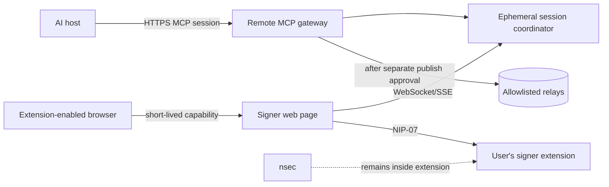

# Free hosted service design

This is the implementation contract for the hosted edition. An accountless Node.js prototype now
exists in `mcp/hosted-server.mjs`; it is not yet a production deployment.

## Product boundary

The recommended public offering has two editions:

| Edition | Who runs the bridge | Key custody | Current state |
|---|---|---|---|
| Free local plugin | Each user | Browser extension or NIP-46 signer | Public-beta candidate |
| Free hosted bridge | Project operator | Browser extension only; service never receives an `nsec` | Accountless prototype implemented; not deployed |

"Free" means no user subscription is planned for the beta. It does not mean hosting has no operator
cost or that unlimited usage can be promised.

## Hosted user journey

1. The AI host opens an unauthenticated Streamable HTTP MCP session.
2. The service creates a cryptographically random, short-lived capability for that session.
3. The plugin returns a signer-page link containing that capability. There is no account, OAuth,
   username, password, or custodial Nostr identity.
5. The user opens that HTTPS page in a browser profile containing the same NIP-07 identity.
6. The page connects only to the isolated session named by the capability.
7. The AI prepares an exact event and displays it for review.
8. The signer page displays the same event and requires a click before invoking the extension.
9. The extension approves or rejects and returns only the public key or signed event.
10. Publishing remains a separate explicit action, with per-relay acknowledgements returned.

The service must reject raw private keys at every public boundary. GitHub Secrets, Cloudflare Secrets,
environment variables, databases, and local encrypted files are not acceptable Nostr-key stores for
this product because the server would need recoverable signing authority at runtime.

## Architecture

## Required controls

| ID | Requirement | Launch evidence |
|---|---|---|
| HS-001 | Stable public HTTPS streamable-MCP endpoint | External initialization and tool-discovery capture |
| HS-002 | Accountless, high-entropy capability sessions; no OAuth or user account | Positive, unknown-capability, replay, expiry, and disconnect tests |
| HS-003 | One user and one signer page per isolated session | Cross-tenant access test |
| HS-004 | Short-lived, single-use browser pairing codes | Replay and expiry tests |
| HS-005 | No endpoint, schema, log, metric, or backup accepts an `nsec` | Encoded-secret red-team suite and log review |
| HS-006 | Exact event equality, hash, signature, and signer-pubkey verification | Tamper and signer-mismatch tests |
| HS-007 | Separate sign and publish confirmations | Negative review cases and audit events |
| HS-008 | Fixed relay allowlist for hosted beta | SSRF and unsupported-scheme tests |
| HS-009 | Per-user and per-IP rate limits, event-size bounds, and abuse response | Load, spam, and denial tests |
| HS-010 | Ephemeral draft/session data with documented TTL and deletion | Durable readback showing expiry and deletion |
| HS-011 | Redacted logs; no raw drafts, ciphertext plaintext, tokens, or pairing secrets | Production log sampling |
| HS-012 | Monitoring, dependency alerts, rollback, incident response, and status page | Recovery drill |
| HS-013 | Public support, privacy, terms, security, and data-deletion URLs | Live URL checks |
| HS-014 | Accurate annotations on every MCP tool | OpenAI Scan Tools output |
| HS-015 | Five positive and three negative reviewer-ready test cases | Recorded expected and actual responses |

## Deliberate v1 exclusions

- No pasted or uploaded private keys.
- No server-side key generation or custody.
- No NIP-44 encrypt/decrypt in the hosted beta; those calls can expose message plaintext to the service
  even when the Nostr private key stays in the extension.
- No arbitrary user-supplied relay URLs.
- No hosted Grynvault invoice tool until payment-flow abuse limits and account-link privacy are reviewed.
- No unattended/background signing.
- No mobile compatibility claim.
- No promise of permanent free or unlimited service.

## Accountless session model

The hosted beta has no user identity or account layer. A random MCP session ID isolates the AI
connection and a separate 256-bit URL capability pairs the extension-enabled browser to that session.
Both expire after inactivity. Possession of the pairing URL grants access to that one temporary
session, so the URL must be treated like a short-lived password and must never appear in logs,
analytics, referrers, or public messages.

The signer public key becomes known only after the user connects the extension. Event signing still
requires exact-event review and extension approval; publication remains a separate action.

## Delivery stages and gates

### H1 — Private hosted alpha

Implement HS-001 through HS-008 behind an allowlist. Gate H1 passes only when two separate accounts
cannot observe or complete each other's operations and no secret-shaped input reaches logs.

### H2 — Security and operations

Implement HS-009 through HS-012, commission an independent review, run a rollback/recovery drill, and
publish the retention/deletion behavior. Gate H2 passes only with written reviewer approval and
captured operational evidence.

### H3 — Public beta and plugin review

Publish HS-013 materials, complete HS-014 and HS-015, verify the publisher and domain, and submit the
remote MCP server through the OpenAI plugin portal. Gate H3 passes only after approval and a clean
production smoke test using a non-production Nostr identity.

## Hosting choice

The implemented prototype is a portable Node.js Streamable HTTP service with in-memory sessions. Run
`npm run build` and `npm run start:hosted`, set `PUBLIC_BASE_URL` to the external HTTPS origin, and put
the process behind a TLS-terminating reverse proxy. Production deployment still requires shared rate
limiting, bounded capacity, monitoring, and a multi-instance session strategy or explicit
single-instance routing. No deployment secret may contain a user's Nostr private key.
