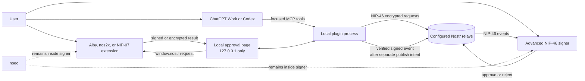

# Nostr Signer for ChatGPT and Codex

A local-first, open-source signer bridge that lets ChatGPT Work or Codex request Nostr signatures from Alby, nos2x, another NIP-07 browser extension, or an advanced NIP-46 remote signer. The signer keeps the private key. This project never needs, accepts, stores, logs, or transmits an `nsec`.

> Release status: v0.3.0 local public-beta candidate. The simulated path, loopback bridge, portable release gate, and annotated MCP surface are tested locally. One live local NIP-07 flow was reported on 2026-09-10, but its browser and signer versions were not captured, so provider-specific compatibility and public relay readback remain unverified.

## Will it work for everyone?

Not yet. The current release is for desktop users who can run Node.js 22+, connect a local stdio MCP
server, and open the approval page in a Chrome- or Firefox-family profile with a compatible NIP-07
extension. It is not a hosted ChatGPT-web service, mobile signer, or unattended signing daemon.

The free local plugin is the right first public release because each user keeps the key and runs the
bridge. It needs no OAuth or separate account: the browser extension supplies the Nostr public key and
approves each signature. A free hosted edition is possible without holding private keys, but ChatGPT's
remote MCP connection needs an OAuth 2.1 compatibility envelope. Its authorization page can use a
fresh Nostr-signed challenge as the only user login—no separate password—while OAuth binds the ChatGPT
connection to that verified Nostr identity. A hosted edition also needs per-user session isolation,
abuse controls, privacy/retention operations, and an independent security review. See
`LAUNCH_READINESS.md`, `COMPATIBILITY.md`, and `HOSTED_SERVICE.md`.

## The ordinary-user journey

1. Install and start the plugin locally.
2. Open the local setup page at `http://127.0.0.1:34846/` in the Chrome or Firefox profile where Alby, nos2x, or another NIP-07 signer is installed.
3. Click **Connect browser extension** once and approve public-key access in the extension. Keep this page open.
4. Ask ChatGPT or Codex to prepare a Nostr note.
5. Review the exact note. Tell ChatGPT or Codex to request the signature.
6. The local page shows the exact pending operation. Click **Continue in extension**, then approve in the extension if it asks.
7. Separately tell ChatGPT or Codex to publish. A post is reported live only when at least one relay acknowledges it.

Never paste an `nsec`, raw private key, seed phrase, or backup into ChatGPT, Codex, the setup page, or a tool call. If an `nsec` was exposed, rotate it in a trusted signer outside this project.

## Architecture



The code separates the signer interface, session/intent state, relay gateway, MCP adapter, and local UI. A future MCP Apps component, WebMCP site tool, hardware signer, or different transport can reuse the service layer without changing event-validation policy.

## What is implemented

- Primary NIP-07 bridge for Alby, nos2x, and compatible extensions: one local connection, one queued approval at a time, random request IDs, stale-response rejection, and no private-key access.
- Advanced `bunker://` and client-generated `nostrconnect://` flows using `nostr-tools` NIP-46 support.
- `get_public_key`, exact generic-event and kind:1 preparation, bound `sign_event`, `nip44_encrypt`, `nip44_decrypt`, separately confirmed `publish_event`, and bounded relay reads for kinds 0 and 1.
- Exact unsigned-event validation, signature/hash verification, signer-pubkey binding, one-use signing intents, timeouts, session expiry, and stale-pairing rejection.
- Per-relay publication acknowledgements. No success claim when every relay rejects or times out.
- In-memory-only signer sessions. Restarting or disconnecting forgets pairing material and prepared events.
- A localhost-only setup page with a per-process anti-CSRF token, request size limit, no external scripts, and no persistence.
- Redacted structured logs and hard rejection of `nsec`-like input.
- Signed Grynvault account-dashboard access plus separately prepared/confirmed supporter and 2,000-sat
  `name@frontiercrown.com` NIP-05 invoice requests. An invoice response is always reported as pending,
  never as payment or settlement.
- Portable Agent Plugins manifests plus the scaffolded Codex compatibility manifest.
- A deterministic safe simulated signer/relay path for CI and onboarding.

## Local setup

Requirements: Node.js 22 or later and npm. Use a test Nostr identity for the public beta.

```bash
npm ci
cp .env.example .env
npm run build
npm start
```

Set `NOSTR_RELAYS` to comma-separated `wss://` relay URLs before live pairing or publication. The example file contains starting values, not an availability guarantee. `ws://` is rejected except for `localhost`/loopback test relays.

The setup page binds to and accepts only `127.0.0.1`. Open it in the browser profile containing your NIP-07 extension—not the Codex in-app browser unless that browser actually has such an extension. Connect once and keep the tab open while signing. The page queues the exact request and requires a browser-side click before calling `window.nostr`. That interaction gate is not proof of human presence when the host also has browser automation, so the extension's own approval policy remains the final protection.

The advanced section accepts a `bunker:` URI only in memory and never logs it. A generated `nostrconnect:` URI contains an ephemeral pairing secret; treat it as sensitive and do not post it publicly.

## Local demo

The safe onboarding demo exercises prepare → sign → verify → publish entirely in memory:

```bash
npm run demo
```

The output includes a simulated public key, event ID, and relay acknowledgement. It does not prove compatibility with a live signer or public relay.

To inspect the real MCP tool surface locally:

```bash
npm run build
npx @modelcontextprotocol/inspector node mcp/server.mjs
```

To connect this checkout directly to a local Codex host without installing a marketplace package:

```bash
codex mcp add nostr-signer -- node /absolute/path/to/nostr-signer-chatgpt/mcp/server.mjs
```

Then restart the ChatGPT desktop app/Codex host and use `/mcp` or MCP settings to verify the server. For a packaged install, use the included `plugin.json`, `mcp.json`, `.codex-plugin/plugin.json`, `.mcp.json`, skill, and committed `mcp/server.mjs` bundle in a local marketplace. The current OpenAI documentation distinguishes local Codex stdio support from ChatGPT web: ChatGPT Work/web needs a registered remote HTTPS MCP endpoint or Secure MCP Tunnel. This repository does not create or publish either.

OpenClaw currently documents support for Agent Plugin/Codex bundles. After downloading and unpacking
the release, install the local directory (or the release archive, if your OpenClaw version accepts it),
inspect the plugin, and restart OpenClaw:

```bash
openclaw plugins install /absolute/path/to/nostr-signer-chatgpt
openclaw plugins inspect nostr-signer-chatgpt
```

This package has the required bundle layout, but an OpenClaw installation was not available in this
validation environment. Treat it as intended compatibility until the live install, tool discovery, and
signer round-trip are captured in `COMPATIBILITY.md`.

Relevant OpenAI guidance: [plugin packaging](https://developers.openai.com/plugins/build/plugins), [connecting and testing](https://developers.openai.com/plugins/deploy/connect-chatgpt), and [Codex MCP configuration](https://learn.chatgpt.com/docs/extend/mcp).

## Example conversation

> You: Connect my signer safely.
>
> Assistant: Open the local setup URL in the browser profile where Alby or nos2x is installed, click **Connect browser extension**, and approve public-key access. I will wait for the signer status to become connected.
>
> You: Prepare “Hello Nostr” as a note.
>
> Assistant: Here is the exact kind:1 event preview. It is not signed or published. Should I request its signature?
>
> You: Yes, request the signature.
>
> Assistant: The exact request is waiting on the local page. Click **Continue in extension**, then approve in the extension. The verified event will remain signed but not published until you separately tell me to publish.
>
> You: Publish it.
>
> Assistant: Relay A accepted the event; Relay B timed out. The event is live on at least Relay A.

## Tools and safety gates

| Tool | Purpose | Gate |
|---|---|---|
| `get_setup_url` | Return the loopback extension/setup page | None |
| `get_signer_status` | Read in-memory connection state | None |
| `begin_nostrconnect_pairing` | Advanced: create an ephemeral pairing URI | User initiates pairing; signer approves |
| `connect_bunker` | Advanced: connect an existing bunker URI | Prefer localhost UI; signer approves |
| `get_public_key` | Read the signer-exposed public key | Active session |
| `prepare_note` | Bind an exact kind:1 event | No signing or network write |
| `prepare_event` | Bind any exact valid event template | No signing or network write; show every field |
| `sign_event` | Sign exactly one prepared intent | Explicit tool confirmation and signer approval |
| `publish_event` | Publish the verified stored event | Separate explicit confirmation |
| `nip44_encrypt` / `nip44_decrypt` | Ask signer for NIP-44 operation | Explicit confirmation; no plaintext logging |
| `query_events` | Read verified public kind 0/1 events | Bounded filters and result count |
| `disconnect_signer` | Forget session and intents | Explicit confirmation |
| `get_grynvault_account_dashboard` | Sign and retrieve the connected pubkey's read-only Grynvault dashboard | Explicit signed-access confirmation; creates no invoice |
| `prepare_grynvault_supporter_invoice` | Prepare an exact 21–1,000,000-sat donation or 2,100-sat/30-day request | No signing or invoice creation |
| `create_grynvault_supporter_invoice` | Sign and submit one prepared supporter request | Separate explicit invoice-creation confirmation; returns pending only |
| `prepare_grynvault_nip05_invoice` | Check and prepare a 2,000-sat `name@frontiercrown.com` request | No signing, reservation, or invoice creation |
| `create_grynvault_nip05_invoice` | Sign and submit one prepared NIP-05 request | Separate explicit invoice-creation confirmation; no activation claim |

## Grynvault integration

Grynvault authorization uses a fresh kind `27235` Nostr HTTP-auth event bound to the exact HTTPS URL,
POST method, server challenge, and SHA-256 hash of the exact JSON body. The same NIP-07/NIP-46 signer
and signature-verification pipeline is used; the resulting authorization is sent only to the fixed
Grynvault production API origin.

Supporter membership and paid NIP-05 remain different products. A one-time supporter donation can be
21 through 1,000,000 sats, the optional 30-day plan is 2,100 sats, and a
`name@frontiercrown.com` invoice is 2,000 sats. Creating an invoice does not pay it. A checkout URL,
browser redirect, or `pending` response does not activate a supporter entitlement or NIP-05 identifier;
only separately verified BTCPay settlement can do that.

The v115 owner reports production deployed at commit `84e5b7cbe91bdbbdd0118228e3bd4156e8411b65`.
However, both the local resolver and Cloudflare's public DNS-over-HTTPS service reported the exact API
hostname as nonexistent on 2026-09-10. The plugin's mocked contract passes, but its Grynvault tools
cannot work live until that hostname resolves and serves v115. No signed POST or invoice creation was
used for validation.

See `GRYNVAULT_INTEGRATION.md` for the exact MCP inputs, HTTP bodies, and signature tags.

## Signer status

| Signer | Intended connection | Automated evidence | Live evidence in this RC |
|---|---|---|---|
| Simulated signer | In-process test adapter | Passing | Not a live signer |
| Alby | NIP-07 browser bridge | Bridge tests only | Not live-tested |
| nos2x | NIP-07 browser bridge | Bridge tests only | Not live-tested |
| Amber | NIP-46 / bunker-compatible target | Protocol path only | Not tested |
| nsec.app | NIP-46 / bunker-compatible target | Protocol path only | Not tested |
| Clave | NIP-46 / bunker-compatible target | Protocol path only | Not tested |
| Other bunker-compatible signers | `bunker:` or `nostrconnect:` | Protocol path only | Not tested |

“Intended” is not a compatibility claim. Record signer/version, pairing mode, relay set, requested method, approval UI, returned event verification, and publication acknowledgement before changing a signer to “tested.”

## How the NIP-07 bridge works

NIP-07 defines `window.nostr.getPublicKey()`, `window.nostr.signEvent()`, and optional encryption methods for browser pages. The plugin does not inject or impersonate an extension. Its loopback page detects the API supplied by an installed signer, sends one reviewed request to it, and returns the result to the same verification pipeline used by NIP-46. The [NIP-07 specification](https://nips.nostr.com/7) defines the standard interface.

The extension decides whether to prompt, approve, or reject. Multiple installed signer extensions can contend for `window.nostr`; use a dedicated browser profile if selection is ambiguous.

## Why there is no private-key fallback

GitHub and Cloudflare secret stores protect values at rest, but signing code must recover usable key material at runtime. That would turn this plugin into a remotely custodial hot signer and expand signing authority to deployment credentials, operators, and any compromised runtime. Local encrypted storage has the same runtime-unlock problem. This project therefore keeps the private key in the user's extension or remote signer.

## Troubleshooting

- **No relays are configured:** copy `.env.example` to `.env`, or provide relays to the pairing tool. The included start command loads `.env` when it exists.
- **No extension is detected:** copy the setup URL into the Chrome or Firefox profile where Alby or nos2x is installed and unlocked, then reload the page. The Codex in-app browser normally does not share those extensions.
- **More than one extension is installed:** disable the unwanted signer for this site or use a browser profile with only the intended extension.
- **A request is waiting:** keep the setup page open, review the displayed operation, click **Continue in extension**, and complete any extension prompt. Do not silently retry after a timeout.
- **Pairing stays pending:** verify the exact relay set is reachable by both client and signer, approve in the signer, and retry with a fresh URI after five minutes. Pairing URIs are one-session secrets.
- **Signer request times out:** check signer connectivity and relay reachability. Prepare a new event; do not silently retry an ambiguous signing request.
- **All publish acknowledgements fail:** the signed event is retained for an explicit retry during the same session. Check relay policy, authentication requirements, and network access.
- **Setup page will not start:** another process may own port 34846. Set `NOSTR_SETUP_PORT` to a free local port.
- **ChatGPT web cannot reach the server:** stdio is local-host only. Use a reviewed Secure MCP Tunnel for development or deploy an authenticated streamable-HTTP server before hosted use.

## Developer commands

| Command | Result |
|---|---|
| `npm run format` | Format source, tests, and manifests |
| `npm run format:check` | Check formatting without writing |
| `npm run lint` | Run static lint rules |
| `npm run typecheck` | Strict TypeScript check |
| `npm test` | Run unit and mocked integration tests |
| `npm run build` | Type-check and create the committed standalone `mcp/server.mjs` entrypoint |
| `npm start` | Start the real MCP server and local setup page |
| `npm run demo` | Run the fully simulated end-to-end demo |
| `npm run smoke:bundle` | Start the distributable bundle and verify its MCP tools |
| `npm run validate:release` | Check portable manifests, version consistency, required release files, and secret-shaped content |
| `npm run check` | Run the complete release-candidate gate |

See `VALIDATION.md` for the exact local evidence and its limits.

## Limitations and roadmap

- One live local NIP-07 flow was user-reported, but the signer/browser versions were not captured. Live Alby, nos2x, NIP-46 signer, and relay-specific compatibility is not yet proven.
- Sessions are deliberately non-persistent; reconnect after every process restart or expiry.
- The NIP-07 browser tab must remain open because browser extensions expose `window.nostr` only to browser pages.
- An MCP Apps iframe is not used for signing because it does not automatically inherit the user's ordinary browser extensions or their permission model.
- Signer `auth_url` challenges are not surfaced in v0.3.0; NIP-46 signers that rely on them may not complete pairing.
- NIP-46 relay authentication, signer relay switching, offline queues, multi-account selection, and automatic event discovery are not included.
- ChatGPT Work/web needs a remote/tunneled MCP transport, authentication, privacy disclosures, and workspace/public review.
- The v115 Grynvault deployment is owner-reported at exact commit `84e5b7c…`, but its hostname did not
  resolve from this validation environment; the signed production path remains independently unproven.
  Supporter/NIP-05 creation was not called live, so no invoice or payment was created.
- Future work: real compatibility matrix, native-browser handoff helper, the separately gated hosted architecture in `HOSTED_SERVICE.md`, a verified OpenClaw install, and an optional hardware-backed local signer adapter that still never exports a private key.

## License

Apache License 2.0. It is permissive for broad reuse while adding an explicit patent grant and preserving license/notice obligations—useful for a security-sensitive interoperability project that may attract multiple implementations.

## Contributing and security

Read `CONTRIBUTING.md`, `SECURITY.md`, `DECISIONS.md`, `COMPATIBILITY.md`,
`LAUNCH_READINESS.md`, `MARKETPLACE_CHECKLIST.md`, and `THIRD_PARTY_NOTICES.md` before changing
protocol, trust-boundary, packaging, or dependency code. Public launch drafts are in `LAUNCH_KIT.md`;
they have not been posted.
