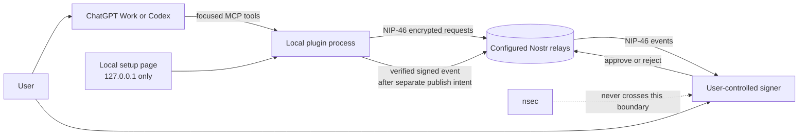

# Nostr Signer for ChatGPT and Codex

A local-first, open-source NIP-46 bridge that lets ChatGPT Work or Codex ask a signer you control to sign Nostr events. The signer keeps the private key. This project never needs, accepts, stores, logs, or transmits an `nsec`.

> Release status: local release candidate. The simulated path is tested. The live NIP-46 path is implemented but has not yet been compatibility-tested with a real signer or public relay.

## The ordinary-user journey

1. Install and start the plugin locally.
2. Open the local setup page at `http://127.0.0.1:34846/`.
3. Create a `nostrconnect:` pairing URI and scan/open it in your signer, or paste a signer-provided `bunker:` URI into the local page.
4. Ask ChatGPT or Codex to prepare a Nostr note.
5. Review the exact note. Tell ChatGPT or Codex to request the signature.
6. Review and approve in your signer.
7. Separately tell ChatGPT or Codex to publish. A post is reported live only when at least one relay acknowledges it.

Never paste an `nsec`, raw private key, seed phrase, or backup into ChatGPT, Codex, the setup page, or a tool call. If an `nsec` was exposed, rotate it in a trusted signer outside this project.

## Architecture



The code separates the signer interface, session/intent state, relay gateway, MCP adapter, and local UI. A future MCP Apps component, NIP-07 bridge, WebMCP site tool, or different transport can reuse the service layer without changing event-validation policy.

## What is implemented

- Real `bunker://` and client-generated `nostrconnect://` flows using `nostr-tools` NIP-46 support.
- `get_public_key`, exact generic-event and kind:1 preparation, bound `sign_event`, `nip44_encrypt`, `nip44_decrypt`, separately confirmed `publish_event`, and bounded relay reads for kinds 0 and 1.
- Exact unsigned-event validation, signature/hash verification, signer-pubkey binding, one-use signing intents, timeouts, session expiry, and stale-pairing rejection.
- Per-relay publication acknowledgements. No success claim when every relay rejects or times out.
- In-memory-only signer sessions. Restarting or disconnecting forgets pairing material and prepared events.
- A localhost-only setup page with a per-process anti-CSRF token, request size limit, no external scripts, and no persistence.
- Redacted structured logs and hard rejection of `nsec`-like input.
- Portable Agent Plugins manifests plus the scaffolded Codex compatibility manifest.
- A deterministic safe simulated signer/relay path for CI and onboarding.

## Local setup

Requirements: Node.js 22 or later and npm.

```bash
npm install
cp .env.example .env
npm run build
npm start
```

Set `NOSTR_RELAYS` to comma-separated `wss://` relay URLs before live pairing or publication. The example file contains starting values, not an availability guarantee. `ws://` is rejected except for `localhost`/loopback test relays.

The setup page binds only to `127.0.0.1`. It is available while the MCP process is running. A `bunker:` URI is accepted there, held only in memory, and never logged. The generated `nostrconnect:` URI contains an ephemeral pairing secret; treat it as sensitive and do not post it publicly.

## Local demo

The safe onboarding demo exercises prepare → sign → verify → publish entirely in memory:

```bash
npm run demo
```

The output includes a simulated public key, event ID, and relay acknowledgement. It does not prove compatibility with a live signer or public relay.

To inspect the real MCP tool surface locally:

```bash
npm run build
npx @modelcontextprotocol/inspector node mcp/server.mjs
```

To connect this checkout directly to a local Codex host without installing a marketplace package:

```bash
codex mcp add nostr-signer -- node /absolute/path/to/nostr-signer-chatgpt/mcp/server.mjs
```

Then restart the ChatGPT desktop app/Codex host and use `/mcp` or MCP settings to verify the server. For a packaged install, use the included `plugin.json`, `mcp.json`, `.codex-plugin/plugin.json`, `.mcp.json`, skill, and committed `mcp/server.mjs` bundle in a local marketplace. The current OpenAI documentation distinguishes local Codex stdio support from ChatGPT web: ChatGPT Work/web needs a registered remote HTTPS MCP endpoint or Secure MCP Tunnel. This repository does not create or publish either.

Relevant OpenAI guidance: [plugin packaging](https://developers.openai.com/plugins/build/plugins), [connecting and testing](https://developers.openai.com/plugins/deploy/connect-chatgpt), and [Codex MCP configuration](https://learn.chatgpt.com/docs/extend/mcp).

## Example conversation

> You: Connect my signer safely.
>
> Assistant: I created a `nostrconnect:` pairing URI. Open it in your signer and approve the connection. I will wait for the signer status to become connected.
>
> You: Prepare “Hello Nostr” as a note.
>
> Assistant: Here is the exact kind:1 event preview. It is not signed or published. Should I request its signature?
>
> You: Yes, request the signature.
>
> Assistant: Please review and approve in your signer. The verified event is now signed but not published. Should I publish it to the configured relays?
>
> You: Publish it.
>
> Assistant: Relay A accepted the event; Relay B timed out. The event is live on at least Relay A.

## Tools and safety gates

| Tool | Purpose | Gate |
|---|---|---|
| `get_signer_status` | Read in-memory connection state | None |
| `begin_nostrconnect_pairing` | Create an ephemeral pairing URI | User initiates pairing; signer approves |
| `connect_bunker` | Connect an existing bunker URI | Prefer localhost UI; signer approves |
| `get_public_key` | Read the signer-exposed public key | Active session |
| `prepare_note` | Bind an exact kind:1 event | No signing or network write |
| `prepare_event` | Bind any exact valid event template | No signing or network write; show every field |
| `sign_event` | Sign exactly one prepared intent | Explicit tool confirmation and signer approval |
| `publish_event` | Publish the verified stored event | Separate explicit confirmation |
| `nip44_encrypt` / `nip44_decrypt` | Ask signer for NIP-44 operation | Explicit confirmation; no plaintext logging |
| `query_events` | Read verified public kind 0/1 events | Bounded filters and result count |
| `disconnect_signer` | Forget session and intents | Explicit confirmation |

## Signer status

| Signer | Intended connection | Automated evidence | Live evidence in this RC |
|---|---|---|---|
| Simulated signer | In-process test adapter | Passing | Not a live signer |
| Amber | NIP-46 / bunker-compatible target | None | Not tested |
| nsec.app | NIP-46 / bunker-compatible target | None | Not tested |
| Clave | NIP-46 / bunker-compatible target | None | Not tested |
| Other bunker-compatible signers | `bunker:` or `nostrconnect:` | Protocol path only | Not tested |

“Intended” is not a compatibility claim. Record signer/version, pairing mode, relay set, requested method, approval UI, returned event verification, and publication acknowledgement before changing a signer to “tested.”

## NIP-07 is separate

NIP-07 is a browser-extension API commonly exposed as `window.nostr` to web pages. This v1 plugin is not a browser extension, does not inject `window.nostr`, and does not give arbitrary pages access to the signer. A future bridge may reuse the backend interfaces, but it needs its own origin permissions, threat model, approval UX, and tests.

## Troubleshooting

- **No relays are configured:** copy `.env.example` to `.env`, or provide relays to the pairing tool. The included start command loads `.env` when it exists.
- **Pairing stays pending:** verify the exact relay set is reachable by both client and signer, approve in the signer, and retry with a fresh URI after five minutes. Pairing URIs are one-session secrets.
- **Signer request times out:** check signer connectivity and relay reachability. Prepare a new event; do not silently retry an ambiguous signing request.
- **All publish acknowledgements fail:** the signed event is retained for an explicit retry during the same session. Check relay policy, authentication requirements, and network access.
- **Setup page will not start:** another process may own port 34846. Set `NOSTR_SETUP_PORT` to a free local port.
- **ChatGPT web cannot reach the server:** stdio is local-host only. Use a reviewed Secure MCP Tunnel for development or deploy an authenticated streamable-HTTP server before hosted use.

## Developer commands

| Command | Result |
|---|---|
| `npm run format` | Format source, tests, and manifests |
| `npm run format:check` | Check formatting without writing |
| `npm run lint` | Run static lint rules |
| `npm run typecheck` | Strict TypeScript check |
| `npm test` | Run unit and mocked integration tests |
| `npm run build` | Type-check and create the committed standalone `mcp/server.mjs` entrypoint |
| `npm start` | Start the real MCP server and local setup page |
| `npm run demo` | Run the fully simulated end-to-end demo |
| `npm run smoke:bundle` | Start the distributable bundle and verify its MCP tools |
| `npm run validate:skill` | Validate the bundled Nostr operating skill |
| `npm run validate:plugin` | Run the installed plugin-creator validator |
| `npm run check` | Run the complete release-candidate gate |

See `VALIDATION.md` for the exact local evidence and its limits.

## Limitations and roadmap

- Live signer and relay compatibility is not yet proven.
- Sessions are deliberately non-persistent; reconnect after every process restart or expiry.
- The local setup page is a secure equivalent for connection entry in this RC. An MCP Apps iframe is not included because passing a secret-bearing bunker URI through a model-visible tool call would be a worse default. A future UI can use the MCP Apps bridge with a reviewed data boundary.
- Signer `auth_url` challenges are not surfaced in v0.1.0; signers that rely on them may not complete pairing.
- NIP-46 relay authentication, signer relay switching, offline queues, multi-account selection, and automatic event discovery are not included.
- ChatGPT Work/web needs a remote/tunneled MCP transport, authentication, privacy disclosures, and workspace/public review.
- Future work: real compatibility matrix, MCP Apps connection card/QR, authenticated streamable HTTP, WebMCP/site-tools adapter, optional encrypted local session vault, and separately reviewed NIP-07 bridge.

## License

Apache License 2.0. It is permissive for broad reuse while adding an explicit patent grant and preserving license/notice obligations—useful for a security-sensitive interoperability project that may attract multiple implementations.

## Contributing and security

Read `CONTRIBUTING.md`, `SECURITY.md`, `DECISIONS.md`, `MARKETPLACE_CHECKLIST.md`, and `THIRD_PARTY_NOTICES.md` before changing protocol, trust-boundary, packaging, or dependency code.
